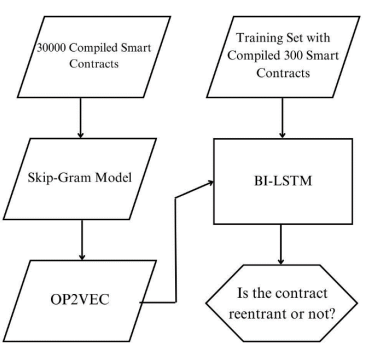

# blockchain-vulnerability-detection
Dataset and notebook code for the article below: 

H. O. Demir, S. Z. Parlat and A. Gumus, "Ethereum Blockchain Smart Contract Vulnerability Detection Using Deep Learning," 2023 7th International Symposium on Innovative Approaches in Smart Technologies (ISAS), Istanbul, Turkiye, 2023, pp. 1-5, doi: 10.1109/ISAS60782.2023.10391797.  [(link to paper)](https://ieeexplore.ieee.org/abstract/document/10391797) 

## Abstract

Blockchain technology, employing advanced cryptography, stands as an optimal means to establish trust among unfamiliar online counterparts. It facilitates secure transactions and consensus among participants. Ethereum, a prominent blockchain network, extends this utility by introducing smart contracts. These are predefined programs containing data and methods for execution. Once deployed, these contracts remain unalterable due to blockchain’s immutable nature. However, unlike conventional software that can be readily patched, they may harbor vulnerabilities. Smart contracts operate with the Ethereum cryptocurrency Ether, rendering fixes intricate and economically impactful. Static analyzers exist to spot vulnerabilities in smart contacts during development, but they are time-intensive. We propose a machine learning-based approach for detecting reentrancy vulnerabilities in smart contracts. Our system comprises three components: data preparation, Op2Vec, and an LSTM model. We collected 30,000 smart contracts, dividing them into two sets of 15,000 each for Op2Vec generation and LSTM training, respectively. We mapped opcode keywords to vector representations using a Skip-Gram algorithm, resulting in a 100-dimensional dictionary with 72 unique opcodes. Labeling was done using the Slither static analyzer, with 116 contracts identified as vulnerable and an additional 132 clean contracts for dataset balance. A Bidirectional LSTM (Bi-LSTM) model was devised by employing assembly data to detect flaws. The developed Bi-LSTM model demonstrated promise in reentrancy vulnerability detection, achieving a 96% accuracy rate in testing and reducing the analysis time to less than a fifth of that required by static analyzers. 

## Repo Contents

- **lstm_model.ipynb** : The model notebook,contains all data flow and code. Tensorflow is used in implementation.
- **vectors_v2.kv** : Our vector embeddings. We vectorized all assembly commands to with Skip-Gram.
- **final.csv** : The contract dataset, each row corresponds compiled code of contracts and target variable which indicates whether contract is vulnerable or not.


## Model Architecture 



You can see our overall artchitecture above. We firstly gathered 30000 smart contracts from the internet and divided them into two parts. We compiled first 15000 contract and used them to create our vector embeddings(**vectors_v2.kv**). The second part is used for creating **contracts.csv**. We passed the second part to static analyzer and get 200+ vulnerable contracts. To balance dataset we add clean contracts. Then we used Bi-LSTM to train and inference.


## Citation 

If you use the our research in your research, please cite our related publication: 

```bibtex
@article{10391797,
  author={Demir, Huseyin Okan and Parlat, Sule Zeynep and Gumus, Abdurrahman},
  booktitle={2023 7th International Symposium on Innovative Approaches in Smart Technologies (ISAS)}, 
  title={Ethereum Blockchain Smart Contract Vulnerability Detection Using Deep Learning}, 
  year={2023},
  volume={},
  number={},
  pages={1-5},
  keywords={Training;Smart contracts;Decentralized applications;Rendering (computer graphics);Data models;Blockchains;Cryptocurrency;Smart Contracts;Bi-LSTM;Reentrancy;Op2Vec;Blockchain;Vulnerability Detection},
  doi={10.1109/ISAS60782.2023.10391797}}
